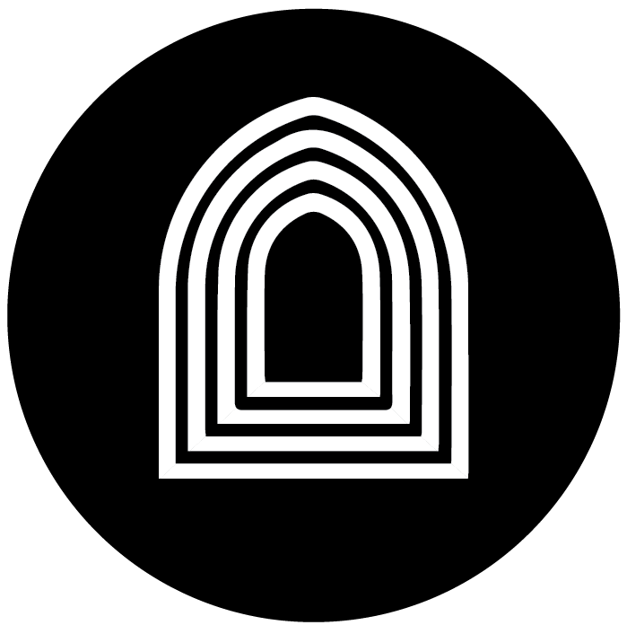

# 🎭 Centro Cultural Banreservas - Plataforma de Gestión

<div align="center">
  
  
  [](https://nextjs.org/)
  [](https://fastapi.tiangolo.com)
  [](https://www.typescriptlang.org/)
  [](https://www.mongodb.com/)
  [](https://tailwindcss.com/)
</div>

## 📋 Descripción

Sistema integral de gestión de visitantes y eventos culturales para el Centro Cultural Banreservas. Una plataforma moderna y escalable construida con tecnologías de vanguardia para transformar la experiencia cultural digital.

## ✨ Características Principales

### 🎫 **Gestión de Eventos**
- **8 Categorías Culturales**: Cinema Dominicano, Cine Clásico, Cine General, Talleres, Conciertos, Charlas/Conferencias, Exposiciones de Arte, Experiencias 3D Inmersivas
- **CRUD Completo**: Creación, edición, eliminación y gestión de eventos
- **Upload de Imágenes**: Sistema de subida para material promocional
- **Control de Capacidad**: Gestión automática de cupos y disponibilidad

### 👥 **Sistema de Usuarios**
- **Autenticación Segura**: JWT con roles diferenciados
- **Perfiles Completos**: Información personal y profesional
- **Roles y Permisos**: Usuario estándar y Administrador
- **Registro Simplificado**: Onboarding fluido

### 📱 **Reservas Inteligentes**
- **Códigos QR**: Generación automática para check-in
- **Códigos Alfanuméricos**: Sistema único de 8 caracteres
- **Check-in Flexible**: Por QR, código, email o teléfono
- **Notificaciones**: Confirmaciones y recordatorios automáticos

### 📊 **Panel Administrativo**
- **Dashboard en Tiempo Real**: Métricas y estadísticas actualizadas
- **Gestión Completa**: Control total del sistema
- **Reportes Avanzados**: Analytics y tendencias
- **Segmentación ML**: Análisis inteligente de usuarios

## 🚀 Demo en Vivo

### 🌐 URLs del Sistema
- **Frontend**: http://localhost:3000
- **Backend API**: http://localhost:8002
- **Documentación API**: http://localhost:8002/docs
- **Panel Admin**: http://localhost:3000/admin

### 👤 Credenciales de Prueba

#### Administrador Principal
- **Email**: `admin@banreservas.com.do`
- **Contraseña**: `Admin2024CCB!`

#### Admin de Prueba
- **Email**: `admin@culturalcenter.com`
- **Contraseña**: `admin123`

## 🏗️ Arquitectura Técnica

### 🎨 **Frontend (Next.js 14)**
```
frontend/
├── app/                    # App Router (Next.js 14)
│   ├── auth/              # Sistema de autenticación
│   ├── events/            # Gestión de eventos
│   ├── admin/             # Panel administrativo
│   └── globals.css        # Estilos globales con variables CSS
├── components/
│   ├── ui/                # shadcn/ui components
│   ├── features/          # Componentes de funcionalidades
│   ├── layout/            # Layouts y navegación
│   └── providers/         # Context providers
├── lib/                   # Utilidades y configuraciones
├── hooks/                 # Custom React hooks
├── stores/                # Zustand state management
└── types/                 # Definiciones TypeScript
```

### ⚡ **Backend (FastAPI)**
```
backend/
├── server.py             # Servidor principal FastAPI
├── analytics/            # Sistema de analytics con ML
├── core/                 # Configuraciones y seguridad
├── models/               # Modelos de datos
├── reports/              # Generación de reportes
├── services/             # Servicios de negocio
└── admin_manager.py      # Gestión de administradores
```

## 🛠️ Stack Tecnológico

<div align="center">

| **Frontend** | **Backend** | **Database** | **Styling** |
|:---:|:---:|:---:|:---:|
| Next.js 14 | FastAPI | MongoDB | Tailwind CSS |
| TypeScript | Python 3.8+ | Redis | shadcn/ui |
| Zustand | JWT Auth | - | Framer Motion |

</div>

### 📦 **Dependencias Principales**

#### Frontend
- **Framework**: Next.js 14 con App Router
- **UI Components**: shadcn/ui (Radix UI + Tailwind)
- **Estado**: Zustand para gestión de estado
- **Formularios**: React Hook Form + Zod
- **Autenticación**: NextAuth.js
- **Animaciones**: Framer Motion
- **TypeScript**: Configuración estricta

#### Backend
- **Framework**: FastAPI con Pydantic
- **Base de Datos**: MongoDB + PyMongo
- **Cache**: Redis para analytics
- **Auth**: JWT con python-jose
- **Emails**: SendGrid integration
- **ML**: Scikit-learn para segmentación
- **Reportes**: ReportLab + Matplotlib

## 🚀 Instalación y Configuración

### 📋 **Requisitos Previos**
- Node.js 18+
- Python 3.8+
- MongoDB 4.4+
- Redis (opcional, para analytics)

### 🔧 **Configuración Rápida**

#### 1. **Clonar el Repositorio**
```bash
git clone https://github.com/onick/VUECCB.git
cd VUECCB
```

#### 2. **Backend Setup**
```bash
cd backend

# Instalar dependencias
pip3 install -r requirements.txt
pip3 install redis

# Configurar variables de entorno
cp .env.example .env
# Editar .env con tus credenciales

# Iniciar servidor
python3 -m uvicorn server:app --reload --port 8002
```

#### 3. **Frontend Setup**
```bash
cd frontend

# Instalar dependencias
npm install

# Variables de entorno (ya configuradas)
# NEXT_PUBLIC_API_URL=http://localhost:8002

# Iniciar desarrollo
npm run dev
```

#### 4. **Servicios Opcionales**
```bash
# MongoDB
docker run -d -p 27017:27017 --name mongodb mongo:latest

# Redis (para analytics)
docker run -d -p 6379:6379 --name redis redis:alpine
```

### 🔑 **Gestión de Administradores**

```bash
cd backend

# Listar administradores existentes
python3 admin_manager.py list

# Crear admin por defecto
python3 admin_manager.py create-default

# Crear admin personalizado
python3 admin_manager.py create "Nombre" "email@domain.com" "password" "telefono"
```

## 🎯 Funcionalidades Implementadas

### ✅ **Completadas**
- [x] Configuración completa de Next.js 14 con App Router
- [x] Sistema de autenticación JWT funcional
- [x] Componentes UI modernos con shadcn/ui
- [x] Gestión de estado con Zustand
- [x] Navegación responsive con dark/light mode
- [x] Integración Frontend-Backend completa
- [x] Sistema de tipos TypeScript
- [x] Panel de administración base
- [x] Gestión de usuarios administradores
- [x] Sistema de notificaciones

### 🔄 **En Desarrollo**
- [ ] CRUD completo de eventos culturales
- [ ] Sistema de reservas con códigos QR
- [ ] Dashboard administrativo con métricas
- [ ] Upload y gestión de imágenes
- [ ] Sistema de notificaciones por email
- [ ] Analytics avanzado con ML

### 📋 **Roadmap Futuro**
- [ ] PWA (Progressive Web App)
- [ ] Notificaciones push en tiempo real
- [ ] Integración con redes sociales
- [ ] Sistema de reviews y comentarios
- [ ] Marketplace de eventos
- [ ] API pública para terceros

## 📱 Características de Diseño

### 🎨 **UI/UX Moderno**
- **Mobile-First**: Diseño responsivo optimizado
- **Dark/Light Mode**: Soporte completo de temas
- **Animaciones**: Micro-interacciones suaves
- **Accesibilidad**: Cumple estándares WCAG
- **Performance**: Optimizaciones automáticas

### 🌈 **Sistema de Colores CCB**
```css
/* Brand Colors */
--ccb-blue: #003087      /* Azul principal */
--ccb-lightblue: #0066CC /* Azul claro */
--ccb-gold: #FFD700      /* Dorado */
--ccb-gray: #F5F5F5      /* Gris suave */
```

## 🔐 Seguridad

- **JWT Authentication**: Tokens seguros con expiración
- **Validación Robusta**: Zod para schemas del frontend
- **CORS Configurado**: Protección contra solicitudes maliciosas
- **Sanitización**: Limpieza de datos de entrada
- **Rate Limiting**: Protección contra ataques de fuerza bruta
- **Environment Variables**: Configuración segura

## 📊 Performance

- **Lazy Loading**: Carga bajo demanda de componentes
- **Code Splitting**: Optimización automática de Next.js
- **Image Optimization**: Componente optimizado de Next.js
- **Caching Estratégico**: Redis para datos frecuentes
- **Bundle Analysis**: Monitoreo continuo

## 🤝 Contribución

### 🔀 **Flujo de Trabajo**
1. Fork el proyecto
2. Crear rama: `git checkout -b feature/nueva-caracteristica`
3. Commit: `git commit -m 'feat: agregar nueva característica'`
4. Push: `git push origin feature/nueva-caracteristica`
5. Abrir Pull Request

### 📏 **Estándares de Código**
- **ESLint + Prettier**: Configuración estricta
- **Conventional Commits**: Formato estándar
- **TypeScript**: Tipado estricto
- **Component Documentation**: JSDoc cuando sea necesario

## 📄 Documentación

- **[API Documentation](http://localhost:8002/docs)**: Swagger UI interactiva
- **[Backend Setup](backend/README.md)**: Guía de configuración del backend
- **[Architecture Guide](README_NUEVO.md)**: Documentación técnica detallada

## 🚀 Deployment

### 🐳 **Docker**
```bash
# Próximamente: Docker Compose setup
docker-compose up -d
```

### ☁️ **Cloud Deploy**
- **Frontend**: Vercel, Netlify
- **Backend**: Railway, Heroku, DigitalOcean
- **Database**: MongoDB Atlas
- **Cache**: Redis Cloud

## 📞 Soporte

- **Issues**: [GitHub Issues](https://github.com/onick/VUECCB/issues)
- **Discussions**: [GitHub Discussions](https://github.com/onick/VUECCB/discussions)
- **Email**: soporte@banreservas.com.do

## 📝 Licencia

Este proyecto está bajo la Licencia MIT - ver [LICENSE](LICENSE) para más detalles.

## 👥 Equipo

<div align="center">

**Centro Cultural Banreservas - Equipo de Desarrollo**

*Transformando la experiencia cultural digital* 🎭✨

---

[](https://github.com/onick/VUECCB)
[](https://nextjs.org/)
[](https://fastapi.tiangolo.com/)

</div>
